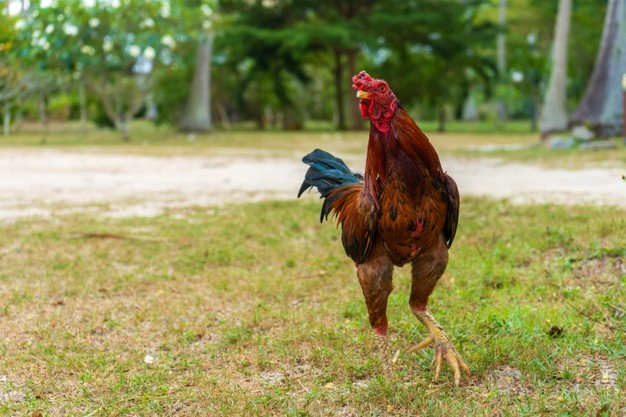

# TILDI KAICHON

An image classifier model that classifies 'Thai Fighting Cock / Fighting Rooster'. 

This model classifies bags into eight classes namely; 

- (1) ไก่นกแดง Nok Daeng (Red)
- (2) ไก่เทาหางขาว Tao Hang Khao (Grey with white tail)
- (3) ไก่ทองแดงหางดำ Tong Daeng Hang Dam (Copper with black tail)
- (4) ไก่ด่างเบญจรงค์ (Benjarong Spotted)
- (5) ไก่นกกรดหางดำ Nok Kod Hang Dam (Reddish with Black tail)
- (6) ไก่ประดู่หางดำ Pradoo Hang Dam (Partridge black red with black tail)
- (7) ไก่ประดู่เลาหางขาว Pradoo Hang Khao (Partridge black red with white tail)
- (8) ไก่เหลืองหางขาว Luang Hang Khao (Yellow with white tail)

## To run
run pip install -r requirements.txt

## Author
Kao Panboonyuen

## Credit
https://github.com/Nwosu-Ihueze/first_deploy
